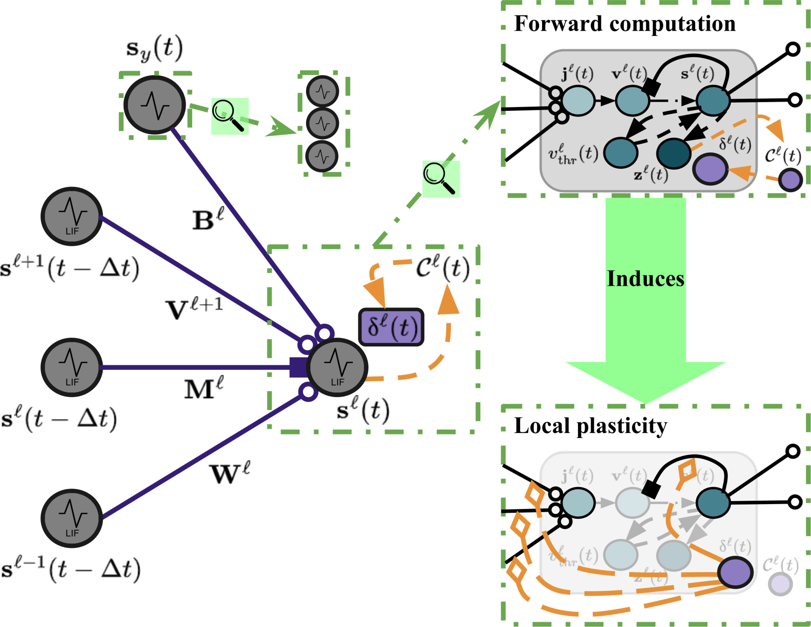

# Contrastive-Signal-Dependent Plasticity (Ororbia, 2023)

<b>Version</b>: ngclearn>=1.2.beta3, ngcsimlib>=0.3.beta4

This exhibit contains an implementation of the self-supervised spiking neural network (SNN), which adapted its synaptic efficacies via contrastive-signal-dependent plasticity (CSDP), proposed and studied in:

Alexander G. Ororbia. "Contrastive signal–dependent plasticity: Self-supervised learning in spiking neural circuits." Science Advances (Sci. Adv.10, eadn6076(2024).DOI:10.1126/sciadv.adn6076). (2024).

<p align="center">
  <br>
  <i>Visual depiction of a spiking cell (and connecting synapses) in a CSDP architecture/process.</i>
</p>

## Running the Model's Simulation

To train this implementation of SINDy, simply the run the provided Bash script as below:

```console
$ ./sim_csdp.sh 0 ## the integer is the index of the GPU
```

which will execute and run the model simulation for CSDP-trained SNN. (Note that you can modify the `sim_csdp.sh` script to point to other datasets, beyond the MNIST databas used in the original work. If KMNIST is to be used, you will need to download and place it in the correct spot, i.e., the `/data/` folder.)

<!--
This model is also discussed in the ngc-learn
<a href="https://ngc-learn.readthedocs.io/en/latest/museum/csdp.html">documentation</a>.
-->

<i>Note</i>: This is a port of the repository of the model, written in ngc-learn, originally released publicly <a href="https://github.com/ago109/contrastive-signal-dependent-plasticity">here</a>.

### Running the Model Evaluation/Analysis

To evaluate your CSDP model after training it as above, run the following analysis BASH script:
```console
./eval_csdp.sh 0
```

This script will run your CSDP SNN model (inference-only) on the test subset of the MNIST database. 
Inside your model directory, e.g., `exp_supervised_mnist/`, the analysis script above also creates a 
sub-directory called `/tsne/`. It is in here that you will find a t-SNE plot of your model's 
extracted latent codes (as well as a numpy array containing the tSNE embedding codes).

## Description

This model implementation effectively reproduces the CSDP-trained SNN model developed in (Ororbia, 2024). This model is effectively a self-supervised spiking neural network that can engage in downstream supervised (i.e., classification) or unsupervised tasks (input signal reconstruction). CSDP can be, as derived in the appendix of (Ororbia, 2024), shown to be two oppositely-pointed pre-synaptic-driven spike-timing-dependent plasticity (STDP) synaptic adjustments. Furthermore, CSDP is a form of biologically-plausible contrastive learning -- this means that CSDP's credit assignment process, which does not require the introduction of feedback pathways or message passing (as in predictive coding), requires a process that produces out-of-distribution (negative) data patterns that can be compared against in-distribution (positive) data patterns. As in the original paper, this implementation provides some simple tools to generate or "mine" these negative patterns on-the-fly, though it was remarked in the original paper that a better, more biologically-grounded way of synthesizing negative samples would be desirable in future work.

<i>Task</i>: This model engages in self-superivsed learning (SSL), meaning it inherently works towards learning representations of its input without estimating input densities or predicting target label values (there are two flavors of self-supervised learning, depending on what flag is used in the simulation Bash script, i.e., `supervised` triggers the use of labels/context to drive the SSL whereas `unsupervised` triggers the use of non-label/context means of engaging in SLL). However, this model, as in the original paper, has modular attachments that allow it to perform classification and input signal reconstruction, which is what is tracked throughout simulation. 

## Hyperparameters

This model requires hyperparameters that are tuned to produce results similar to (Ororbia, 2024). Please see the provided constructor in `csdp_model.py` for choices and explication of relevant/internal meta-parameter values  as well as the supplement/appendix that supports the original (Ororbia, 2024) article.

## Notes

This code was written on/run on an Ubuntu 22.04.2 LTS and 
assumes that you have Python 3.10.6 or Python 3.10.12, jax/jaxlib 0.4.28 (for Cuda-12), and ngclearn 1.2.b3 (with ngcsimlib 0.3.b4) successfully installed on your system. It is important that you ensure you are using/working with the `release` versions of ngc-learn and ngcsimlib when simulating this particular code-base/exhibit implementation. 

If you want to ensure you are working with the right expected release versions, you can run the optionally included pip installation script that comes with this model exhibit:

```console
$ pip install -r requirements.txt  ## install required libraries in your playground VM
```

If you use this code or model mathematics in any form in your project(s), please cite its source
article:
<pre>
@article{
	doi:10.1126/sciadv.adn6076,
	author = {Alexander G. Ororbia },
	title = {Contrastive signal–dependent plasticity: Self-supervised learning in spiking neural circuits},
	journal = {Science Advances},
	volume = {10},
	number = {43},
	pages = {eadn6076},
	year = {2024},
	doi = {10.1126/sciadv.adn6076},
	URL = {https://www.science.org/doi/abs/10.1126/sciadv.adn6076}
}
</pre>
