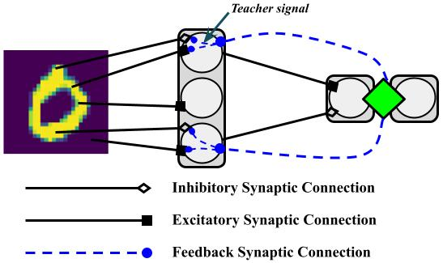

# Samadi et. al. Spiking Neural Network

<b>Version</b>: ngclearn==1.1.beta1, ngcsimlib==0.3.beta1

This exhibit contains an implementation of the spiking neural network trained
with broadcast feedback alignment (ngc-learn refers to this model as the
BFA-SNN) proposed and studied in:

Samadi, Arash, Timothy P. Lillicrap, and Douglas B. Tweed. "Deep learning with
dynamic spiking neurons and fixed feedback weights." Neural computation 29.3
(2017): 578-602.

<p align="center">
  <br>
  <i>Visual depiction of the BFA-SNN architecture.</i>
</p>

This model is also discussed in the ngc-learn
<a href="https://ngc-learn.readthedocs.io/en/latest/museum/snn_bfa.html">documentation</a>.

## Running the Model's Simulation

To train this implementation of the BFA-trained SNN, simply run:

```console
$ python train_bfasnn.py --dataX="/path/to/train_patterns.npy" \
                         --dataY="/path/to/train_labels.npy" \
                         --devX="/path/to/dev_patterns.npy" \
                         --devY="/path/to/dev_labels.npy" \
                         --verbosity=0
```

or, alternatively, you may run the convenience bash script:

```console
$ ./sim.sh
```

which will execute and run the model simulation for MNIST.

Note that you can point the training script to other datasets besides the
default MNIST, just ensure that the targets for `dataX`, `dataY`, `devX`, and
`devY` are numpy arrays of shape `(Number data points x D)` for data patterns  
(i.e., `dataX` and `devX`) and shape `(Number data points x C)` for labels
(`dataY` and `devY`).


## Description

This model is effectively made up of three layers -- a sensory input layer 
(which encodes a normalized pixel image to a Bernoulli spike train), 
one hidden layer of (simplified) leaky integrator (SLIF) cells, and one 
output layer of SLIFs to make predictions of target values, e.g., one-hot encodings of
label values. Each layer connects to the next via a simple two-factor
Hebbian synapse (pre-synaptic term is the spikes produced by the 
layer below and post-synaptic term is either error neuron post-activation
values at the output layer or a teaching signal produced by BFA for 
the hidden layer); the entire model is a simple x-to-y
spiking discriminative model. Feedback/error message passing pathways
are not learned and set to be fixed, random values (as per the original BFA scheme).

<i>Task</i>: This model engages in supervised/discriminative adaptation, learning
to predict the labels of different input digit patterns sampled from the MNIST
database.

## Hyperparameters

This model requires the following hyperparameters, tuned to produce results much akin
to that of the original Samadi et al., 2017 model, except we simulate our model over 
`25` simulated milliseconds:

```
T = 100 (number of time steps to simulate)
dt = 0.25 ms (integration time constant)
tau_m = 20 ms (LIF membrane time constant)
v_thr = 0.4 (voltage threshold)
num_hidden_units = 1000 (number hidden LIFs)
## BFA synaptic update meta-parameters (using SGD)
batch_size = 250
eta1_w = 1.0/num_input_units (layer 1's learning rate)
eta2_w = 1.0/num_hidden_units (layer 2's learning rate)
```

Note we do not encode the error units at the output layer (layer 2) in terms 
of signed populations of error units, as mentioned in Samadi et al., 2017, 
and we encode the input layer as Bernoulli spike trains, whereas in Samadi et al., 2017, 
raw input pixel values were fed in at each time step.
