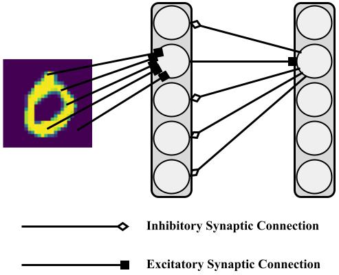

# Diehl and Cook Spiking Neural Network

<b>Version</b>: ngclearn==1.1.beta1, ngcsimlib==0.3.beta1

This exhibit contains an implementation of the spiking neuronal model proposed
and studied in:

Diehl, Peter U., and Matthew Cook. "Unsupervised learning of digit recognition
using spike-timing-dependent plasticity." Frontiers in computational
neuroscience 9 (2015): 99.

## Running the Model's Simulation

To train this implementation of Diehl and Cook's model (also referred to
in ngc-learn as the DC-SNN), simply run:

```console
$ python train_dcsnn.py --dataX="../data/mnist/trainX.npy" --n_samples=10000
```

Note that you can point the training script to other datasets besides the
default MNIST, just ensure that the target for `dataX` is a numpy array of
shape `(Number data points x Pattern Dimensionality)`.

Alternatively, you may run the convenience bash script:

```console
$ ./sim.sh
```

which will execute and run the model simulation for MNIST.

<p align="center">
  <br>
  <i>Visual depiction of the DC-SNN architecture.</i>
</p>

This model is also discussed in the ngc-learn
<a href="https://ngc-learn.readthedocs.io/en/latest/museum/snn_dc.html">documentation</a>.

## Description

This model is effectively made up of three layers -- a sensory input layer made up
of Poisson encoding neuronal cells, a hidden layer of excitatory leaky integrators,
and another layer of inhibitory leaky integrators. The sensory layer connects to
excitatory layer with a synaptic cable that is adapted with traced-based
spike-timing-dependent plasticity. The excitatory layer connects to the inhibitory
layer with a fixed identity matrix/cable (all excitatory neurons map one-to-one to
inhibitory ones) while the inhibitory layers connects to the excitatory layer
via a fixed, negatively scaled hollow matrix/cable.

The dynamics that result from the above structure is a form of sensory input-driven
leaky integrator dynamics that are recurrently inhibited by the laterally-wired
inhibitory leaky integrators.

<i>Task</i>: This model engages in unsupervised representation learning and simply
learns sparse spike train patterns that correlate with different input digit patterns
sampled from the MNIST database.

## Hyperparameters

This model requires the following hyperparameters, tuned to produce results much akin
to that of the original Diehl and Cook model:

```
T = 200 (number of discrete time steps to simulate)
dt = 1 ms (integration time constant)
## Note: resistance scale values set to 1
tau_m_e = 100.500896468 ms (excitatory membrane time constant)
tau_m_i = 100.500896468 ms (inhibitory membrane time constant)
tau_tr= 20. ms (trace time constant)
## STDP hyper-parameters
Aplus = 1e-2 (LTD learning rate (STDP); or "nu1" in literature)
Aminus = 1e-4 (LTD learning rate (STDP); or "nu0" in literature)
w_norm = 78.4 (L1 norm constraint)
norm_T = 200 ms (time to enforce norm constraint)
factor = 22.5 (excitatory-to-inhibitory synapse scale factor)
factor = -120 (inhibitory-to-excitatory synapse scale factor)
## excitatory dynamics (with adaptive threshold)
thr = -52 mv
v_rest = -65 mv
v_reset = -60 mv
tau_theta = 1e7
theta_plus = 0.05
## inhibitory dynamics (with NO adaptive threshold)
thr = -40 mv
v_rest = -60 mv
v_reset = -45 mv
```

In effect, the model enforces a synaptic re-scaling based on an L1 norm
at the end of `200` milliseconds (ms) -- this re-scaling step is maintained
by the particular STDP synapse used in our implementation of Diehl and Cook's
model as every component have access to the simulation object's clock.

<i>Model Simplification</i>: The original Diehl and Cook model also incorporated
synaptic conductance, i.e., electrical currents were modeled by differential
equations as well, whereas our exhibit implements currents as point-wise
injections. However, if synaptic conductance is desired, one could extend the
model to use electrical currents built with ngc-learn `RateCell`s, which offer
the machinery needed for (leaky) graded/continuous valued dynamics.
