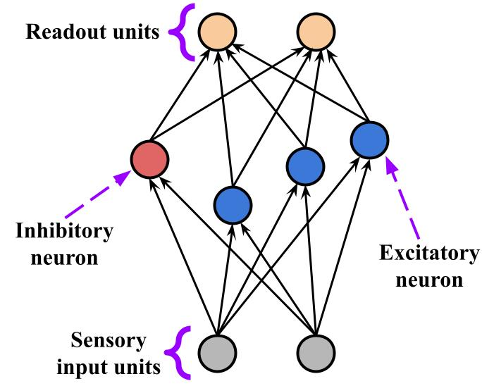

# Excitatory-Inhibitory Recurrent Neural Network

<b>Version</b>: ngclearn==3.0.1, ngcsimlib==3.0.0

This exhibit contains a variant implementation of the excitatory-inhibitory recurrent neural network (EI-RNN) 
model proposed and studied in:

```
Song, H. F., Yang, G. R., & Wang, X. J. (2016). Training excitatory-inhibitory recurrent neural networks for 
cognitive tasks: a simple and flexible framework. PLoS computational biology, 12(2), e1004792.
```

Note that this model is fit to data differently than the EI-RNN of Song et al. (2016); whereas those authors trained 
theirs via backpropagation of errors (through time), this variant uses eligibility traces in tandem with local 
gradients. 

## Running the Model's Simulation

To train this implementation of the EI-RNN model, simply run:

```console
$ python sim_ei_rnn.py --dataX="../data/mnist/trainX.npy" --n_samples=10000
```

Alternatively, you may run the convenience bash script:

```console
$ ./sim.sh
```

which will execute and run the model simulation over the synthetic time-series.

<p align="center">
  <br>
  <i>Visual depiction of the EI-RNN architecture.</i>
</p>

<!--
This model is also discussed in the ngc-learn
<a href="https://ngc-learn.readthedocs.io/en/latest/museum/ei_rnn.html">documentation</a>.
-->

## Description

This model is effectively made up of three layers -- a sensory input layer, a recurrently-wired 
hidden layer/population of excitatory and inhibitory rated-coded neurons (the ratio of inhibitory to excitatory 
neurons is 4:1), and another layer of output/readout neural units. The 
input-to-hidden, recurrent (hidden-to-hidden), and hidden-to-output synaptic connections are all adjusted via local 
gradients (implemented in the form of Hebbian-like rules) accumulated via eligibility traces. Note that all synaptic 
efficacies are enforced to be non-negative and the signs are fixed a priori (meaning that excitatory connections remain 
excitatory, and inhibitory connections remain inhibitory, throughout the simulation of the model; this adheres to 
Dale's law/principle).

<i>Task</i>: This model engages in time-series forecasting, via next time-step prediction (essentially, this means 
that this model iteratively optimizes a sequence loss), given a single, synthetically-generated time-varying stream of 
data values.

## Hyperparameters

This model uses (by default) the following hyperparameters:

```
## optimization meta-parameters
n_iter = 40 (number training iterations / epochs)
eta = 0.0002
optim_type = "adam" (synaptic adjustment rule - Adam)
tau_elg = 40. ms (eligibility trace time constant)
## EI-RNN model meta-parameters
n_hid = 10 (EI-RNN hidden population size, i.e., 8 excitatory & 2 inhibitory neurons)
dt = 10 ms (EI-RNN integration time constant)
tau_x = 100 ms (EI-RNN membrane time constant)
act_fx = "relu" (EI-RNN post-membrane activation)
sigma_rec = 0.1 (standard deviation of EI-RNN pre-synaptic noise)
```
