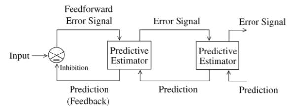
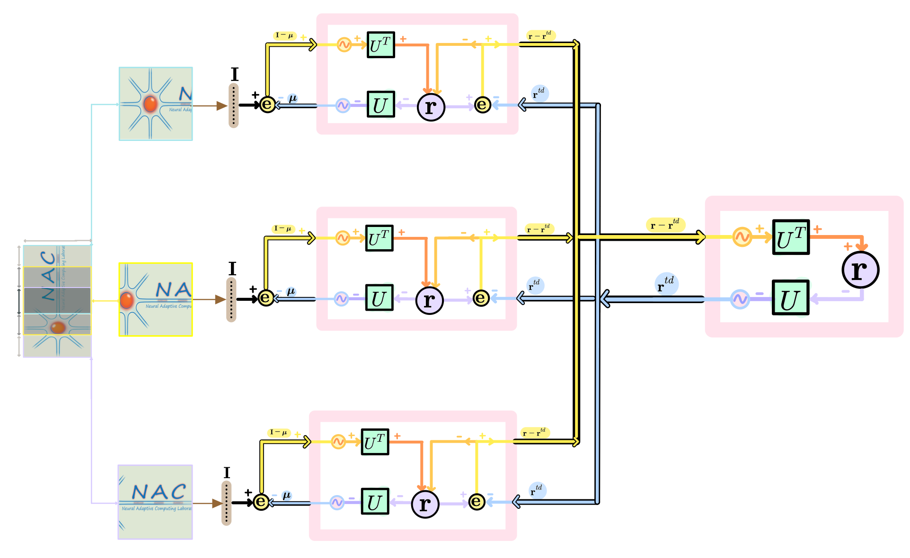
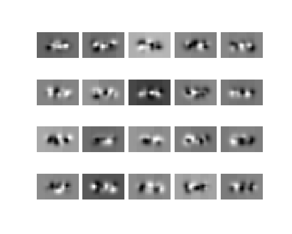

# Reconstructive Hierarchical Predictive Coding (Rao &amp; Ballard, 1999)

<b>Version</b>: ngclearn==3.0.0, ngcsimlib==3.0.0 <!--2.0.0 1.0.0 -->

This exhibit contains an implementation of the predictive coding (PC) model specialized 
for the task of reconstruction. This model is effectively a variant that embodies key 
characteristics across several classical efforts, such as:

```
Rao, Rajesh PN, and Dana H. Ballard. "Predictive coding in the visual cortex: a functional interpretation of some extra-classical receptive-field effects." Nature neuroscience 2.1 (1999): 79-87.
```

<!--
```
Friston, Karl. "Hierarchical models in the brain." PLoS computational biology 4.11 
(2008): e1000211.

Ororbia, Alexander, and Daniel Kifer. "The neural coding framework for learning 
generative models." Nature communications 13.1 (2022): 2064.

Rao, Rajesh PN, and Dana H. Ballard. "Predictive coding in the visual cortex: a functional interpretation of some extra-classical receptive-field effects." Nature neuroscience 2.1 (1999): 79-87.
```
-->

and, furthermore, incorporating the sparse kurtotic prior (over neural activities) from:

```
Olshausen, Bruno A., and David J. Field. "Emergence of simple-cell receptive field 
properties by learning a sparse code for natural images." Nature 381.6583 
(1996): 607-609.
```


<table>
  <tr>
    <td></td>
    <td></td>
  </tr>
  <tr>
    <td align="center">(Original) <em> Visual depiction of the PC reconstruction architecture (Rao & Ballard, 1999)</td>
    <td align="center">(Re) <em> Replotted version of the original hierarchical PC reconstruction architecture.</td>
  </tr>
</table>


Receptive field weighting profiles (Learned synaptic weights)
<table>
  <tr>
    <td></td>
    <td></td>
  </tr>
  <tr>
    <td align="center">(Le) <em> RF profiles of level-2 feedforward model neurons (Rao & Ballard, 1999 - Figure 2.C)</td>
    <td align="center">(Re) <em> RF profiles of level-1 feedforward model neurons (Rao & Ballard, 1999 - Figure 2.b). Resembling classical oriented-edge/bar detectors characteristic of simple cells. </td>
  </tr>
</table>


<!--
This model is also discussed in the ngc-learn
<a href="https://ngc-learn.readthedocs.io/en/latest/museum/pcn_recon.html">documentation</a>.
-->

## Running the Model's Simulation

To train this implementation of PC, simply run:

```console
$ python train_pc.py --path_data="/path/to/dataset_arrays/" 
                     --n_samples=-1 --n_iter=10
```

<!--
Alternatively, you may run the convenience bash script:

```console
$ ./sim.sh
```

which will execute and run the model simulation for MNIST.
-->

Note that you can point the training script to other datasets besides the
default MNIST, just ensure that the targets inside of the directory provided 
for `path_data` are two numpy arrays of shape 
`(Number data points x D)`, one labeled `trainX.npy` (training set) and 
another labeled `testX.npy` (test/dev-set). 

## Description

This model is effectively made up of four layers -- a sensory input layer and three internal/hidden layers of graded rate-cells (each equipped with linear rectifier elementwise activation functions), and one output layer for reading out predictions of target values. Each layer connects to the next via a simple two-factor Hebbian synapse (pre-synaptic term is the post-activation values of layer below and post-synaptic term is the error neuron post-activation values of the current layer). The entire model is a simple z to x hierarchical generative model. Feedback/error message passing pathways are not learned in this variant and each synaptic cable's set of weight values is set to be equal to the transpose of the corresponding forward synaptic cable's set of weight values.

<i>Task</i>: This model engages in unsupervised reconstruction, learning to predict the pixel values of different input digit patterns sampled from the MNIST database. Note this implementation operates with patches extracted from the target image patterns.

## Hyperparameters

This model requires the following hyperparameters, tuned to produce good-quality receptive fields (in the bottom layer closest to the sensory input) and reconstructed digit input patterns:

```
T = 20 (number of time steps to simulate, or number of E-steps to take)
dt = 1 ms (integration time constant)
tau = 20 ms (rate-cell membrane time constnat)
lmbda = 0.14 (strength of Laplacian prior enforced over hidden activities)
## synaptic update meta-parameters
eta = 0.005 (learning rate of SGD optimizer embedded w/in each synaptic cable for the M-step)
batch_size = 100
```


