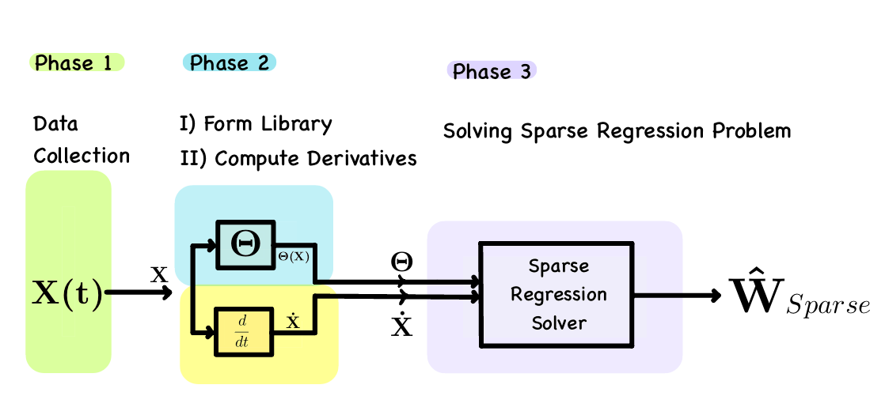

# SINDy (Brunton et al., 2016)

<b>Version</b>: ngclearn>=1.2.beta3, ngcsimlib>=0.3.beta4

This exhibit contains an implementation of the sparse identification of non-linear 
dynamical systems(SINDy) model proposed and studied in:

Brunton, Steven L., Joshua L. Proctor, and J. Nathan Kutz. 
"Discovering governing equations from data by sparse identification of nonlinear 
dynamical systems." Proceedings of the national academy of sciences 113.15 
(2016): 3932-3937.

<p align="center">
  <br>
  <i>Visual depiction of the SINDy architecture/process.</i>
</p>

## Running the Model's Simulation

To train this implementation of SINDy, simply the run the Python script below:

```console
$ python train_sindy.py
```

which will execute and run the model simulation for a selected simulated dynamical 
system. (Note that you can modify the `train_sindy.py` to point to other 
pre-designed dynamical systems as explored in the Brunton et al., 2016 article).

This model is also discussed in the ngc-learn
<a href="https://ngc-learn.readthedocs.io/en/latest/museum/sindy.html">documentation</a>.

## Description

This model implementation effectively reproduces the SINDy model developed 
in Brunton et al., 2016. This model can be interpretted as a temporal version 
of sparse coding/dictionary learning that attempts to solve for a sparse set 
of coefficients that select portions of a function library, ultimately yielding 
an approximate explanation of an examined dynamical system (given only samples collected 
from its consistuent differential equations).

<i>Task</i>: This model engages in unsupervised form of dictionary learning and 
learns sparse codes (to select functions from its dictionary/library matrix) to 
explain samples collected from an (unknown) dynamical system 
(Brunton et al., 2016).

## Hyperparameters

This model requires the following hyperparameters, tuned to produce results similar 
to (Brunton et al., 2016). Please see provided constructor in `sindy.py` for choices 
and explication of relevant/internal meta-parameter values.


