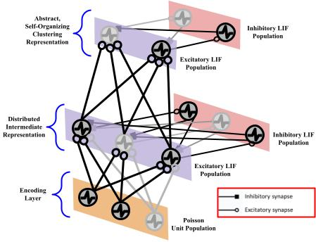

# Time-Integrated Spike-Timing-Dependent Plasticity

<b>Version</b>: ngclearn>=1.2.beta1, ngcsimlib==0.3.beta4

This exhibit contains an implementation of the spiking neuronal model 
and credit assignment process proposed and studied in:

Gebhardt, William, and Alexander G. Ororbia. "Time-Integrated Spike-Timing-
Dependent Plasticity." arXiv preprint arXiv:2407.10028 (2024).

<p align="center">
  <br>
  <i>Visual depiction of the TI-STDP-adapted SNN architecture.</i>
</p>

<!--
The model and its biological credit assignment process are also discussed in 
the ngc-learn
<a href="https://ngc-learn.readthedocs.io/en/latest/museum/tistdp.html">documentation</a>.
-->

## Running and Analyzing the Model Simulations

### Unsupervised Digit-Level Biophysical Model 

To run the main TI-STDP SNN experiments of the paper, simply execute:

```console
$ ./train_models.sh 0 tistdp snn_case1
```

which will trigger three experimental trials for adaptation of the 
`Case 1` model described in the paper on MNIST. If you want to train 
the online, `Case 2` model described in the paper on MNIST, you simply 
need to change the third argument to the Bash script like so:

```console
$ ./train_models.sh 0 tistdp snn_case2
```

Independent of whichever case-study you select above, you can analyze the 
trained models, in accordance with what was done in the paper, by executing 
the analysis bash script as follows:

```console
$ ./analyze_models.sh 0 tistdp  ## run on GPU 0 the "tistdp" config
```

<i>Task</i>: Models under this section engage in unsupervised representation 
learning and jointly learn, through spike-timing driven credit assignment, 
a low-level and higher-level abstract distributed, discrete representations 
of sensory input data. In this exhibit, this is particularly focused on 
using patterns in the MNIST database.

### Part-Whole Assembly SNN Model

To run the patch-model SNN adapted with TI-STDP, enter the `patch_model/` 
sub-directory and then execute:

```console
$ ./train_patch_models.sh
```

which will run a single trial to produce the SNN generative assembly
(or part-whole hierarchical) model constructed in the paper.

<i>Task</i>: This biophysical model engages in a form unsupervised 
representation learning that is focused on learning a simple bi-level 
part-whole hierarchy of sensory input data (in this exhibit, the focus is on 
using data from the MNIST database).

## Model Descriptions, Hyperparameters, and Configuration Details

Model explanations, meta-parameters settings and experimental details are 
provided in the above reference paper.
